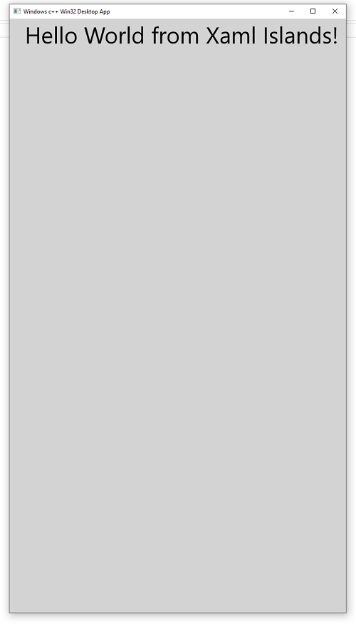

# cppwinrt-clang
A sample C++/WinRT app using the clang compiler

## Requirements
- Install LLVM >= 9.0.0 and add it to your path
- Install Windows 10 1903 SDK to  C:\Program Files (x86)\Windows Kits\10\References\10.0.18362.0

## A.) Build with Visual Studio, using clang
- Open cppwinrt-clang.sln and run the application

## B.) Build from command line, using clang
Run ```build.bat```

## C.) Build from command line, using clang with MSVC frontend
Run ```build-with-clang-via-msvc-frontend.batd```

### Running *build.bat* will:

1.) Generate C++/WinRT header files
```
cppwinrt.exe @cppwinrt_plat.rsp
```

2.) Create output folder
```
if not exist build mkdir build
```

3.) Compile with Clang
```
set WINDOWS_SDK=C:\Program Files (x86)\Windows Kits\10\Lib\10.0.18362.0
clang -I "Generated Files" -D_WINDOWS -DUNICODE -D_UNICODE main.cpp -Xclang -std=c++2a \
-Xclang -Wno-delete-non-virtual-dtor -o build\cppwinrt-clang.exe \
-L "%WINDOWS_SDK%\um\x64" -Wl,kernel32.lib,user32.lib,windowsapp.lib
```

4.) Embed the manifest
https://docs.microsoft.com/en-us/cpp/build/how-to-embed-a-manifest-inside-a-c-cpp-application?view=vs-2019
```
"C:\Program Files (x86)\Windows Kits\10\bin\10.0.18362.0\x64\mt.exe" -manifest cppwinrt.manifest \
-outputresource:build\cppwinrt-clang.exe;1
```

**cppwinrt-clang.exe** will appear in the **build** output folder
{width="400px"}
